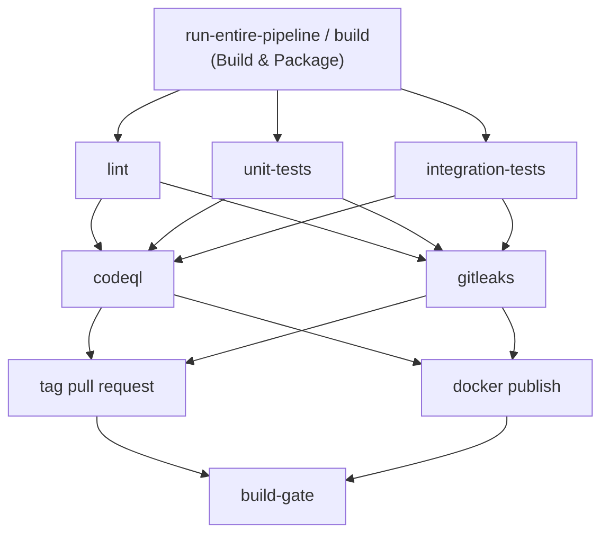

# ci-cd-templates

Centralized, reusable GitHub Actions CI/CD templates for Java (Maven/Gradle + Spring Boot) projects. Consuming repos call these workflows instead of duplicating pipeline logic.

## Structure

- `.github/common/action.yml` — Composite action that installs a JDK (Temurin), sets up dependency caching (maven/gradle), and injects `MAVEN_OPTS`/`GRADLE_OPTS`. Used as a step inside every reusable workflow below.
- `.github/workflows/master-maven-pipeline.yml` — Orchestrator. Calls all the workflows below in order (`build → lint/unit-tests/integration-tests → security → tag → docker-publish`) and gates the pipeline result via `build-gate`.
- `.github/workflows/build.yml` — Compiles/packages the app (Maven or Gradle), rejects committed `.env` files, submits the dependency graph.
- `.github/workflows/lint.yml` — Runs Spotless/Ktlint formatting checks.
- `.github/workflows/unit-tests.yml` — Runs unit tests and publishes JUnit reports.
- `.github/workflows/integration-tests.yml` — Runs integration tests (loads repo secrets into env, supports extra `test-args`).
- `.github/workflows/security.yml` — Runs CodeQL analysis and Gitleaks secret scanning.
- `.github/workflows/tag.yml` — Tags PR builds (`pr-<number>-run-<run_number>`), keeping only the 4 most recent tags per PR.
- `.github/workflows/docker.yml` — Builds a container image via Spring Boot Buildpacks and pushes it to GHCR (tagged `pr-<number>` for PRs, `main-<sha>` otherwise), retaining only the 3 most recent images.
- `.github/workflows/auto-release.yml` — On push to `main`, auto-bumps a semver tag and creates a GitHub release, keeping the 10 most recent releases.

All workflows run behind `step-security/harden-runner` (egress policy configurable via `egress-policy`/`allowed-endpoints` inputs).

## Pipeline Flow



`master-maven-pipeline.yml` orchestrates all of these via `workflow_call`; each job uses `.github/common/action.yml` for JDK/cache setup.

## Usage

In a consuming repo, call the master pipeline from your own workflow:

```yaml
name: CI
on: [push, pull_request]

jobs:
  pipeline:
    uses: Bigorno12/ci-cd-templates/.github/workflows/master-maven-pipeline.yml@main
    secrets: inherit
    with:
      java-version: "25"
      cache-type: "maven"   # or "gradle"
```

Individual workflows (`build.yml`, `lint.yml`, etc.) can also be called independently via `workflow_call` if you don't need the full pipeline.
