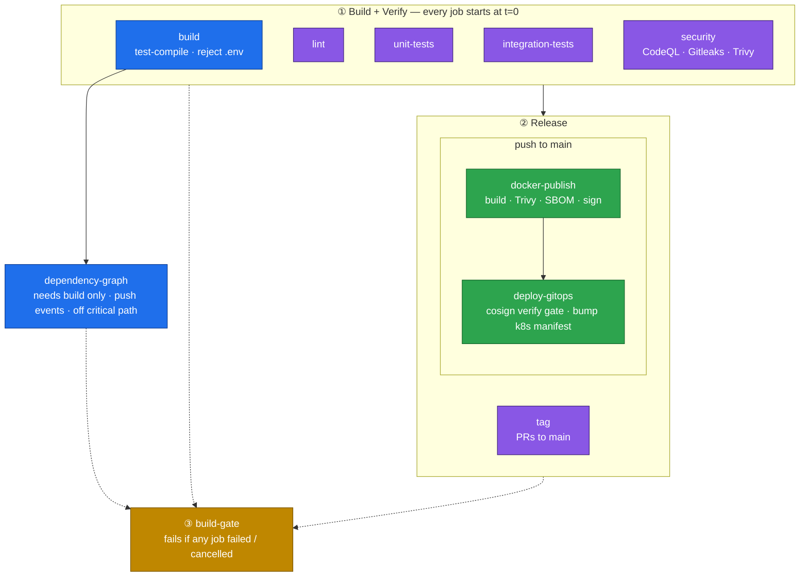

# ci-cd-templates

Reusable GitHub Actions CI/CD templates for Java (Maven + Spring Boot) projects. Consuming repos call these workflows instead of duplicating pipeline logic. Every job runs behind `step-security/harden-runner` with a configurable egress policy and `disable-sudo: true`, third-party actions are pinned to commit SHAs, checkouts use `persist-credentials: false` unless the job genuinely pushes, and per-job `permissions` are scoped to least privilege.

## Usage

Call the master pipeline from a workflow in your repo. Grant the caller the full
set of permissions the pipeline needs — GitHub defaults an unset permission to
`none`, so a missing `id-token: write` silently breaks keyless signing:

```yaml
name: Main CI Orchestrator
on:
  push:
    branches: [ "main" ]
  pull_request:
    branches: [ "main" ]

permissions:
  contents: write        # PR build tags + GitOps commit
  packages: write        # push image to GHCR
  security-events: write # CodeQL SARIF upload
  id-token: write        # cosign keyless signing (REQUIRED — defaults to none)
  actions: read
  checks: write
  pull-requests: write

jobs:
  run-entire-pipeline:
    uses: Bigorno12/ci-cd-templates/.github/workflows/master-maven-pipeline.yml@<sha>
    secrets: inherit
    with:
      java-version: "25"
      cache-type: "maven"
      build-egress-policy: "block"
      release-egress-policy: "block"   # drop to "audit" while tuning buildpack egress
      spring-boot-args: "-P dev -pl rest -am"
      test-args: "-Dspring.profiles.active=dev"
      gitops-manifest-path: "infra/k8s/manifest/api.yaml"
      # Verify gate: the image is signed inside THIS reusable workflow, so the
      # Cosign certificate identity is always the template repo — pin it here
      # unless your repo is under the Bigorno12 org (see Cross-org verification).
      signer-identity-regexp: "^https://github.com/Bigorno12/ci-cd-templates/"
```

Pin `@<sha>` to a template commit that includes the folded verification gate and the
`signer-identity-regexp` / `release-egress-policy` inputs — passing them against
an older pin fails with "invalid input". Individual workflows can also be called
on their own via `workflow_call`.

### What your repo must provide

The templates make these assumptions; a pipeline that fails immediately is usually
one of them:

- `mvnw` and `pom.xml` at the repository root (every job runs `chmod +x mvnw` first).
- A Spotless-configured build — `lint.yml` is exactly `./mvnw spotless:check`.
- Surefire/Failsafe reports at `**/target/*-reports/TEST-*.xml` for the JUnit annotations.
- No tracked `*.env` files other than `.env.example` — `build.yml` fails the build on one.
- For GitOps: a manifest at `gitops-manifest-path` containing an
  `image: ghcr.io/<owner>/<repo>:...` line, which `deploy-gitops` rewrites with `sed`.
- Optional: a root `.trivyignore`. `docker.yml` always passes `trivyignores: .trivyignore`
  to the image scan, so that is where CVE suppressions belong.

## Pipeline



Solid arrows are the run order; dotted arrows feed `build-gate`, which
depends on every phase and runs with `if: always()`. Green nodes are the
supply-chain controls (sign → verify → promote). [ARCHITECTURE.md](ARCHITECTURE.md)
carries the same graph with per-job permissions, plus the input-plumbing, release-sequence
and egress diagrams.

Stage ① is a grouping, not a single workflow: `build` and `verify` are separate
caller jobs in `master-maven-pipeline.yml`, and `verify` fans out into `lint`,
`unit-tests`, `integration-tests` and `security`. All five start at t=0 — verify
has no `needs: build`, because nothing in it consumes build's output (every job
checks out and compiles for itself). `dependency-graph` is the one job with a
narrower dependency: it needs `build` alone, and nothing needs it back, so it
hangs off the side rather than sitting on the critical path. `release` gates on
both `build` and `verify`, so nothing publishes unless the compile gate and
every verification job passed.

| Workflow | Purpose |
|----------|---------|
| `master-maven-pipeline.yml` | The entry point consumers call; owns every input, plus `build-gate` |
| `verify.yml` / `release.yml` | Grouping layers — no steps, only job plumbing and permission narrowing |
| `build.yml` | Fail-fast `test-compile`, reject committed `.env` |
| `dependency-graph.yml` | Submit the Maven dependency graph (push events only) |
| `lint.yml` | Spotless / Ktlint formatting checks |
| `unit-tests.yml` | Unit tests + JUnit reports |
| `integration-tests.yml` | Integration tests (curated secrets via `extra-secrets`) |
| `security.yml` | `codeql` SAST + `gitleaks` secret scan + `trivy-deps` dependency scan |
| `tag.yml` | Tag PR builds `pr-<n>-run-<run>` (keeps 4 newest per PR) |
| `docker.yml` | Buildpack image → GHCR (`pr-<n>` / `main-<sha7>`, keeps 3 newest); Trivy scan, SBOM, keyless Cosign signature + SBOM attestation |
| `deploy-gitops.yml` | Verify the image's Cosign signature, then bump its tag in a k8s manifest on push to `main` |
| `auto-release.yml` | Auto-bump semver tag + GitHub release on push to `main` (keeps 10 newest) |

`tag` runs only on PRs to `main`; `deploy-gitops` only on push to `main`. `build-gate` fails if any job failed or was cancelled.

`dependency-graph` is a separate workflow, not a job inside `build.yml`, for two
reasons. It keeps `build` at `contents: read` — only the graph submission needs
`contents: write`. And it stays **off the critical path**: a `needs:` on a
reusable workflow waits for *every* job inside it, so a graph submission living
in `build.yml` would make `release` wait on bookkeeping nothing downstream
consumes. `build-gate` still reports its result, and it is skipped on pull
requests (a skipped job is not a failure).

`build` runs `test-compile` rather than `package`. Its output is discarded —
nothing is shared downstream — so jar assembly and `spring-boot:repackage` were
pure cost on the serial path ahead of the entire verify phase. `test-compile`
still fails fast on both main and test sources; a genuine packaging failure now
surfaces in `docker-publish` instead of here.

`security.yml`'s `codeql` job probes the Code Scanning API first and fails
closed: HTTP 200/404 runs the analysis, 403 (Code Scanning disabled) skips it
with a warning, and any other status **errors** rather than silently skipping
SAST. `trivy-deps` runs a blocking filesystem scan for fixable `CRITICAL,HIGH`
vulnerabilities, then a non-blocking full report (`vuln,secret,misconfig` down
to `MEDIUM`, including unfixed) for visibility without failing the build.

## Supply-chain security

The release phase applies zero-trust controls between building and promoting an image:

- **Digest pinning** — a `Resolve image reference` step turns the pushed tag into an immutable `name@sha256:...` digest, and every downstream step (Trivy, Syft, `cosign sign`, `cosign attest`, and the deploy gate) operates on that digest. Nothing in the release path trusts a mutable tag, so a tag repointed between build and deploy cannot slip through. On PR builds nothing is pushed, so the local tag is scanned and no signing happens.
- **Keyless signing** — every published image is signed with Cosign via GitHub OIDC (`docker.yml`), no long-lived keys.
- **Signature verification gate** — `deploy-gitops` runs `cosign verify` on the pushed digest as its **first steps**, before any checkout or commit. An unsigned or tampered image aborts the job with the manifest untouched. An empty digest fails closed rather than promoting an unverified artifact.
- **SBOM + vulnerability scan** — a Syft CycloneDX SBOM and a Trivy `CRITICAL,HIGH` scan run against the built image. The SBOM is uploaded as a 30-day artifact **and** bound to the digest as a signed in-toto attestation, so consumers can verify provenance directly from the registry:

  ```bash
  cosign verify-attestation --type cyclonedx \
    --certificate-identity-regexp "^https://github.com/Bigorno12/ci-cd-templates/" \
    --certificate-oidc-issuer "https://token.actions.githubusercontent.com" \
    ghcr.io/<owner>/<repo>@sha256:<digest>
  ```

- **Egress `block`** — build, verify, and release phases default to a blocking harden-runner policy with explicit host allowlists (tune via the `extra-*-endpoints` inputs).

### Cross-org verification

`cosign sign` runs inside this reusable workflow, so the Sigstore certificate
identity (SAN) is always the **template** repo —
`https://github.com/Bigorno12/ci-cd-templates/...` — regardless of which repo
calls the pipeline. The `deploy-gitops` gate matches that identity against
`signer-identity-regexp`.

The input defaults to any workflow under the **caller's** repository owner
(`^https://github.com/<owner>/`), which only lines up when your repo is under the
`Bigorno12` org. If you call these templates from **any other org**, set it
explicitly or the deploy gate fails closed:

```yaml
    with:
      signer-identity-regexp: "^https://github.com/Bigorno12/ci-cd-templates/"
```

Pinning it explicitly is always correct, so it is recommended even within the
same org.

## Shared actions

GitHub does not allow subdirectories under `.github/workflows`, so the workflow
files are necessarily flat. Each workflow is self-contained: it declares its own
`harden-runner` allowlist and its own checkout/JDK preamble, so a job can be read
end-to-end without following indirection.

- `.github/actions/java-setup` — installs Temurin JDK, configures Maven cache, sets `MAVEN_OPTS` (rejects multi-line values so nothing extra can be injected into `GITHUB_ENV`).
- `.github/actions/ghcr-cleanup` — retains the 3 most recent GHCR images (with retry).
- `.github/actions/cache-cleanup` — deletes Actions caches outside the retention policy: anything not on `keep-ref` (PR/feature branches) plus `keep-ref` caches older than `retention-days`. Not wired into the master pipeline; call it from your own scheduled workflow with a token that has `actions: write`.

## Maintaining this repo

These templates are the trust boundary for every repo that calls them, so the
repo runs checks on its own CI code.

**`workflow-lint.yml`** runs on every push to `main` and every pull request
(and is exposed via `workflow_call` if a consumer wants to reuse it):

| Job | What it catches |
|-----|-----------------|
| `actionlint` | Structural errors across all workflows — bad `needs:`, invalid expressions, unknown `runs-on` labels, shellcheck findings inside `run:` blocks. The binary is checksum-verified against a pinned SHA-256 before it executes. |
| `zizmor` | Actions-specific security findings at `medium`+ — unpinned action refs, template injection via `${{ github.event.* }}`, credential persistence, over-broad `permissions`. |

Neither job is path-filtered, and deliberately so: a required check skipped by a
path filter stays permanently pending and blocks the merge instead of passing.
Everything these jobs actually lint lives under `.github/`, so the filter would
buy little even setting that aside.

Both are worth setting as required status checks on `main`; the contexts are
`actionlint` and `zizmor`.

**Local hooks** in `.githook/` mirror the CI checks so failures surface before
they reach a runner. Enable them once per clone:

```bash
git config core.hooksPath .githook
```

- `pre-commit` — `gitleaks protect --staged`, blocking the commit on a detected secret.
- `pre-push` — skips unless the pushed commits touch YAML, then runs `actionlint` and
  `yamllint --strict`. It deliberately passes no `-d`: the ruleset comes from the repo's
  [`.yamllint.yml`](.yamllint.yml) (200 columns, 2-space indent), so the hook and CI share
  one config.

Both hooks degrade to a warning when the tool is not installed
(`brew install gitleaks actionlint yamllint`), so CI remains the enforcement
point — and because `pre-push` is path-gated, a docs-only push runs neither linter
and still reports success.

**Dependabot** (`.github/dependabot.yml`) opens one grouped `github-actions` PR
weekly, with a cooldown before a fresh release is proposed. Because every `uses:`
is SHA-pinned, these PRs are how pins get advanced.

**Editing a composite action is a two-commit change.** The three actions under
`.github/actions/` are consumed by SHA-pinned *self-reference*
(`Bigorno12/ci-cd-templates/.github/actions/java-setup@<sha>`), because inside a reusable
workflow a relative action path resolves against the caller's checkout rather than this
repo. Merge the action change first, then a second commit bumping every pin — until then
the edit is inert. `grep -rn "Bigorno12/ci-cd-templates" .github/` lists all 8 call sites.

### Further reading

| Doc | Contents |
|-----|----------|
| [ARCHITECTURE.md](ARCHITECTURE.md) | The `uses:` call graph, input/permission plumbing, the release sequence, and per-phase egress allowlists as rendered PlantUML diagrams ([`docs/`](docs/)) |
| [CLAUDE.md](CLAUDE.md) | Maintainer guide: house rules for workflow edits, the consumer contract, and where each value is allowed to live |
| [`.claude/rules/workflow-rule.md`](.claude/rules/workflow-rule.md) | The pin / input-default / inline decision, the two gates that reject the alternatives, and current known deviations |
